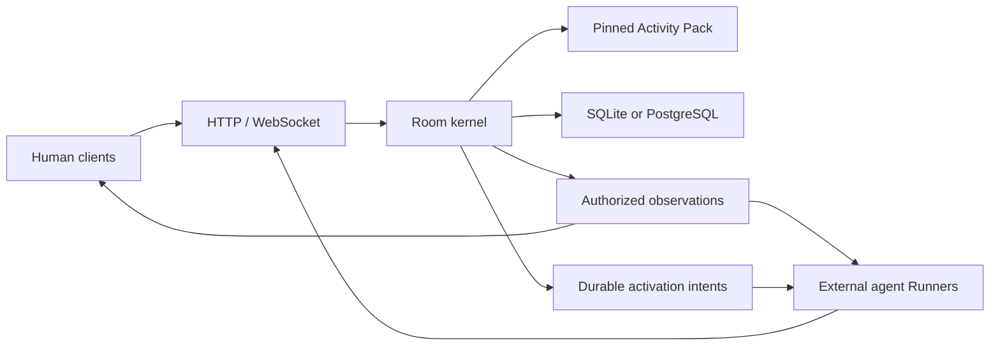

# WorldStream

WorldStream is a Rust kernel for applications with human and AI participants.

WorldStream gives each Room one authoritative state, one ordered history, and
participant-specific views. An Activity Pack defines the rules; external clients
and agent Runners propose Actions. The Rust runtime validates, commits, persists,
and streams the accepted changes.

This repository contains the kernel and the application experiments. Product
development has ended. The activity packs and Agent Swarm are examples of the
kernel's use. They are not supported products. There is no supported production
release or hosted service.

[Project page](https://imom39a.github.io/worldstream/) ·
[Architecture](docs/architecture.md) · [Run locally](docs/getting-started.md) ·
[Examples](examples/README.md)

## The design



- **Room authority.** Accepted Actions, timers, and Membership changes
  enter one ordered history. A client view never becomes a second source of truth.
- **Atomic storage.** State, receipts, observations, timers, and
  activation intents share an atomic storage boundary.
- **Participant access.** Each Membership receives its own Projection and
  Observation Stream, with cursors and explicit resets for reconnection.
- **Replay.** Rooms pin exact Pack revisions. Canonical hashes,
  retained executors, and Replay verify the lineage after restart.
- **Agent execution.** The kernel persists identity and attention;
  Runners own models, prompts, tools, credentials, and bounded Invocations.
- **Storage adapters.** Bundled SQLite and PostgreSQL share Room semantics,
  with backup, restore, and offline transfer support.

The deployment model uses one runtime process. Distributed writers,
multi-region operation, and arbitrary third-party effects are outside its scope.

## Run the kernel

Install the Rust version in [rust-toolchain.toml](rust-toolchain.toml), then run
these commands from the checkout root on Linux or macOS:

```sh
cargo build --locked -p worldstream-server --bins
umask 077
mkdir -p .worldstream/data
if [ ! -e .worldstream/authority.secret ]; then
  head -c 32 /dev/urandom > .worldstream/authority.secret
fi
chmod 600 .worldstream/authority.secret
target/debug/worldstreamd --config config/development.toml
```

In another terminal:

```sh
curl -fsS http://127.0.0.1:9410/readyz
```

This starts a local SQLite-backed runtime without a cloud account, model
provider, Node.js, or Python. See [Getting started](docs/getting-started.md) for
the operator CLI, an end-to-end Counter example, optional SDK tooling, and tests.

## Repository map

| Directory | Purpose |
| --- | --- |
| [`crates/`](crates/) | Kernel, protocol, persistence, Pack host, and operator support |
| [`sdk/`](sdk/) | Python and TypeScript clients; TypeScript Pack authoring SDK/CLI |
| [`examples/`](examples/README.md) | Activity packs, browser clients, agent runners, and Agent Swarm |
| [`docs/`](docs/README.md) | Architecture, protocol, storage, and design decisions |
| [`tests/`](tests/) | Cross-language checks and retained contract fixtures |
| [`site/`](site/) | Dependency-free GitHub Pages site |

Counter and historical Agent Heist executors remain embedded in the kernel's
conformance surface: removing or rewriting them would break exact-revision
Replay. Portable packs and application code live under `examples/`.

## Verify

```sh
scripts/verify-local.sh
```

The default Cargo members are the kernel and operator tools. `cargo test --workspace --locked -- --test-threads=1` also includes the Rust examples. Optional SDK, Pack, and
browser-client checks are listed in [Verification](docs/gates.md).

The [compatibility manifest](compatibility.toml) and its [JSON mirror](compatibility.json)
are retained runtime identity inputs. Their historical release specifications do
not establish a supported release. The retired hosted platform and release
campaign remain available in Git history; [ADR 0044](docs/adr/0044-preserve-kernel-and-examples.md)
records this scope change.

## License

Apache 2.0. See [LICENSE](LICENSE) and [third-party notices](licenses/THIRD-PARTY-NOTICES.txt).
