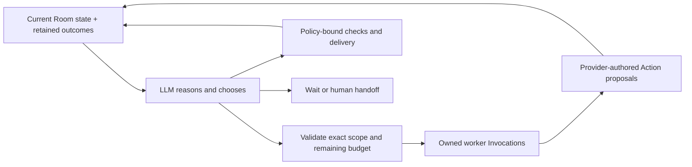

# Adaptive Agent Swarm planning

The LLM decides what to do next. The coordinator enforces what it may do.
This replaces the earlier proposed fixed-count planning pass: there is no
host-authored sequence of propose → claim → contribute and no requirement to
invent a fixed number of tasks.

## Reasoning and authority

An explicit policy enables planning for a confirmed, open execution epoch.
The application asks a qualified roster member to reason over its authorized
Room projection, recent retained Invocation outcomes, and a menu of currently
authorized semantic targets. The model returns a typed decision:

- `dispatch`: select target IDs, roster members, and authored worker
  instructions; dependency revision also selects exact dependency IDs.
- `operate`: select an exact check or delivery target admitted by the local
  delivery policy. No model-authored command or Human Action payload is accepted.
- `wait`: no useful next action now; reconsider when the Room changes.
- `handoff`: request human attention and stop generating work.

The planner is read-only. Its decision is retained local execution evidence,
never a Room Action or a claim that the goal succeeded. It cannot select a
different provider, model, effort, permission policy, or arbitrary Action.
The coordinator checks the exact observed Room sequence, state hash, epoch,
goal revision, direction revision, and member configuration before using it.
A stale decision requires fresh reasoning.



The available ordinary targets currently support proposing bounded Work Items,
claiming eligible work, revising dependencies, and producing Contributions or
reporting blockers on owned Work Attempts. This loop operates on Work Items
created within its own run. It can read existing Room work as context, including
dependencies, but does not silently adopt externally staged work.

The LLM may batch independent owned Work Attempts for different members.
Metadata actions such as claims and dependency revisions are dispatched one
at a time because their existing authority contract binds the exact Room
Head. The native daemon still enforces provider capacity and one active
Invocation per member. Event sourcing serializes accepted state transitions;
it does not require external computations to run serially.

After outcomes settle, the model reasons again. A known terminal worker failure
can lead to a revised instruction or another authorized step. No host rule
chooses the revised strategy. Ambiguous launch/submission effects retain their
explicit reconciliation gate. Three consecutive failed adaptive Invocations
without an accepted worker Action halt further automatic work; successful
reasoning alone does not erase worker failures. The Pack's separate Progress
Review and correction rules still apply.

## Enabling a bounded run

Example policy for a disposable approved working area:

```json
{
  "max_work_items": 4,
  "invocation_limit": 24,
  "resource_policy": "workspace_write",
  "allowed_tools": []
}
```

Supply it with `worker-run --autonomy-policy /absolute/path/policy.json`, along
with the normal managed Runtime, Swarm, coordinator, execution-state, and
qualified-provider arguments. `--once` performs one coordinator cycle; without
it, the existing long-lived service continues observing and dispatching.
This command does not issue Resume. The goal must already be confirmed and
the daemon explicitly resumed.

`max_work_items` is a ceiling (1–32), not a target task count. The model can
wait after fewer items. `invocation_limit` (1–256) counts both planning and
selected worker turns, including failed turns and automatic Progress Reviews
generated after enabling the policy. Externally staged plans remain separate
existing execution activity; use the daemon's total Invocation/time budgets
to limit the entire Swarm.
Workspace-write permission is an explicit policy choice; read-only planning
does not grant worker write permission. Provider-specific tool restrictions
and qualification still apply.

Policy, selected batches, consumed decisions, and budget usage are persisted
before dispatch. Repeating the same policy or reopening the coordinator does
not replenish the budget or repeat a consumed decision. A different policy
conflicts with an existing run. Stop/Pause and crash recovery retain their
existing execution semantics. A handed-off or exhausted run needs operator
intervention; there is no implicit budget reset.

The TUI and command output expose the adaptive phase, reason, generated work
count, and used Invocation budget. Generated work count counts distinct
retained proposal targets; it is not proof that the Pack accepted all of them.

## Autonomous delivery

The [live autonomous delivery evaluation](evidence/agent-swarm-autonomous-delivery/README.md)
demonstrates this bounded loop with 22 production Invocations, independent native
work overlapping for 84.202 seconds, 26 passing fixed checks, a fresh independent
judge, and applied writeback before accepted Result. The evaluator staged no
delivery plans and submitted no post-setup Room Actions.

An optional `delivery` field extends that same loop through integration,
checks, independent review, correction, writeback, and accepted Result. The
model chooses the sequence from current evidence; the evaluation driver does
not supply the continuation. Without this field, existing policies retain
their Contribution-only scope.

```json
{
  "max_work_items": 4,
  "invocation_limit": 40,
  "resource_policy": "read_only",
  "allowed_tools": [],
  "delivery": {
    "target": "answer.txt",
    "resource_id": "answer-resource",
    "expected_resource_version": 1,
    "maximum_candidate_versions": 3,
    "process_guard": "/absolute/path/worldstream-agent-swarm-process-guard",
    "checks": [{
      "check_id": "criterion-1",
      "program": "/absolute/path/trusted-checker",
      "arguments": ["{candidate_root}"],
      "timeout_seconds": 30
    }]
  }
}
```

The target must already be a registered Room resource with matching local path,
digest, and version. Enabling the policy binds the confirmed Goal and Direction,
exact ordered acceptance criteria, working root, original target bytes, and
checker/guard executable digests. Each criterion has one authorized command,
named `criterion-1..N`. Arguments are bounded to 4096 bytes each; commands run
with an empty explicit environment in a copy-isolated candidate directory.
`{candidate_root}` as a whole argument supplies that directory;
`{candidate_root_json}` inside an argument supplies its JSON-quoted path.
The checker must provide any required OS sandbox itself. The live macOS
evaluation uses Seatbelt to deny writes, unrelated file reads, and network.

The planner creates and assigns integration Work Items just as it chooses
ordinary work. An owner integrates actual digest-verified Contributions into
a complete Candidate. The coordinator captures and seals that exact version;
the model then selects the configured checks. Real exit status and bounded,
digest-verified stdout/stderr become planning, integration, and review context.
A failed check can therefore lead to a model-chosen revision. There is no
host-written repair strategy or source implementation.

Independent Candidate review uses a fresh provider conversation and excludes
the Candidate author and every referenced Contribution author. A passing later
review does not clear an earlier blocking finding. Finding resolution remains
an independently authorized, evidence-bearing Action. Non-passing reviews of
the current Candidate require a new version before delivery.

Only a current Candidate with exact passing checks, independent passing review,
and no unresolved blocking findings/conflicts can expose a delivery option.
Selecting it performs the existing guarded writeback, records the actual
outcome, and accepts the Result last. Roster agents never receive Human
credentials. The local coordinator submits only these policy-authorized Human
Actions and retains each exact Action identity and payload before submission.

Operations and evidence are persisted before effects. Restart never repeats a
started operation or an Action with an uncertain reply. Such a run requires
explicit reconciliation using its retained journal; this increment does not
automatically infer whether an unacknowledged write succeeded. A changed Goal,
Direction, resource basis, executable, or destination halts delivery. Checks
have deadlines and observe Stop/recovery/scope changes while running; the
process guard contains their descendants. Pause allows an already selected
operation to drain. It does not authorize another operation.

## Current limits

Invalid dispatch decisions now return to the model with their exact rejected
decision and bounded validation feedback. No partial batch is dispatched. The
feedback survives coordinator reopen, and the existing three-failure and total
Invocation limits still stop repeated failures. This is needed because a real
planner attempted to register three useful tasks concurrently even though those
metadata choices shared one Work ID and required serialization. The host checks
authority; the model chooses the corrected plan.

Autonomous delivery currently handles one complete artifact written to one
existing target file, at most eight Candidate versions, and explicitly supplied
checker commands. It does not yet cover multi-file merges, automatically
running arbitrary agent-authored tests, or reassignment of an already owned
failed attempt. A Contribution can contain code, a report, or analysis; it is
not an accepted Result. New worker output is directed to separate contribution
paths; these paths are instructions, not an OS isolation guarantee for a provider.

The LLM receives retained status/failure categories and Room-referenced
artifacts, not a fabricated explanation of a failed process. Detailed failure
analysis may still need explicit artifact/log access within the approved
working area. This release does not train models or automatically change its
own policy/code. Improving the strategy inside one run differs from validated
long-term learning.

Codex app-server protocol support is implemented, but live provider admission
still requires native qualification. Controlled tests exercise the same
planning/dispatch protocol with deterministic provider fixtures. They prove
coordination and recovery behavior, not real model judgment or coding quality.

## Reproduction

```sh
cargo build --locked -p worldstream-agent-swarm --features managed-local-runtime \
  --bins -p worldstream-server -p worldstream-studio-supervisor
uv run --project sdk/python --python 3.14.7 python \
  scripts/verify-agent-swarm-managed.py --autonomy-report /absolute/path/results.json
```

The controlled managed experiment exercises goal-only bootstrap, two independent
owned Contributions, native overlap, reopening without duplicate decisions,
Pause, a one-Invocation budget, and a failure that requires revised instructions.
The report identifies fixtures explicitly and is published only after managed
process cleanup succeeds. The earlier CSV challenge remains separate evidence
for exact checks, persistent findings, independent review, and writeback conflicts.

To evaluate production delivery on macOS with the already approved native
Codex executable and subscription model, add the delivery flag to the live trial:

```sh
uv run --project sdk/python --python 3.14.7 python \
  scripts/verify-agent-swarm-managed.py \
  --live-autonomous-delivery --live-codex-report /absolute/path/results.json \
  --codex-path /absolute/path/native/codex \
  --live-model gpt-5.6-sol --live-effort medium \
  --acknowledge-live-moving-alias
```

This evaluation performs setup, polls the production coordinator, and collects
evidence. It fails if the evaluator stages any delivery plan or submits any
post-setup Action. The model must achieve useful native parallelism, at least
two attributed Contributions, independent judgment, applied writeback, and a
Room-accepted Result before the report can pass. Reports are published only
after managed process cleanup succeeds. Controlled recovery tests and a live
successful path answer different questions; a live pass alone is not a
reliability estimate.
