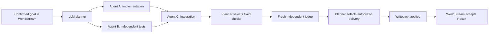

# Live autonomous Swarm delivery — 22 September 2026

**Attempt 2 completed a coding goal through the production planner: decomposition, parallel authoring, integration, checks, independent review and file delivery.** No delivery plans or post-setup Room Actions were supplied by the evaluation driver. The delivered artifact is [csv_tool.py](csv_tool.py).

The run used subscription-backed native Codex 0.149.0 with `gpt-5.6-sol`, `medium`. It finished in **745.240 seconds**; managed setup and cleanup brought the wrapper to **800.955 seconds** (13m 21s). The process continued and completed while the development assistant's conversation was interrupted. No intervention was needed after setup.

| Requirement | Observed evidence |
| --- | --- |
| Decomposition | The model chose implementation, independent behavioral tests, and integration as three Work Items. |
| Useful parallelism | Agents A and B authored implementation and tests concurrently for **84.202 seconds**. Both Contributions were accepted. |
| Integration | The planner assigned Agent C to an integration Work Item depending on both completed items. Its Candidate referenced both Contributions and retained the implementation unchanged. |
| Checks | The planner selected the authorized checker. Candidate version 1 passed **26/26** fixed CSV, JSON and CLI checks. |
| Independent judging | The reserved judge authored neither the Candidate nor either Contribution, used a fresh conversation, and returned `passed` with no findings. |
| Delivery | The planner selected delivery. The production coordinator recorded applied writeback at Room sequence **15**, then accepted one Result at sequence **16**. |
| Adaptation | One malformed planning response put `reason` inside a step rather than the decision. It was rejected before dispatch; the next response corrected the shape. |
| Cleanup | Managed processes stopped, the disposable provider profile was removed, and measured executable/harness identities stayed unchanged. |

The **22 production Invocations** comprise 12 planning turns, three proposals, three claims, three authoring turns and one review. One planning turn was rejected. These counts exclude native admission probes. The evaluator initialized the Room and authorized policy, kept the service ticking, observed progress and collected evidence. It authored no implementation and made no delivery decisions.

WorldStream remains the authoritative kernel. Accepted transitions serialize ownership, dependencies and outcomes; external WorkAttempts can compute in parallel. The model chooses the next permitted step. The coordinator and Pack enforce exact revisions, evidence, authority and effect boundaries.

The goal explicitly required useful concurrency and reserved a judge. The LLM chose the decomposition and sequence within those constraints. Workers were read-only, had no tools, and returned complete artifacts for attributed publication. This does not demonstrate arbitrary repository edits or safe concurrent writes to a shared checkout.

After completion, a separate sandboxed replay ran Agent B's **26 authored tests** against the unchanged delivered file; all passed. That replay was **not part of the live acceptance gate**, and its tests overlap the fixed suite. [Supplemental evidence](supplemental-authored-tests.json).

This proves bounded autonomous delivery for one single-file goal, not a general reliability rate, overall speedup, portable release qualification or cross-run learning. The native judge used the same model family as the authors; it was not JEV. No repair iteration was needed in the successful run. Controlled tests cover failed-check revision and finding resolution; a live repair case remains to be demonstrated.

## Evidence

- [Metrics and native intervals](metrics.json), [complete report](results.json)
- [Production decisions and worker responses](attempt-2-adaptive.json), [delivery operation journal](autonomous-delivery-journal.json)
- [Final Room projection](final-observation.json), [writeback receipt](writeback-receipt.json)
- [Fixed checker](fixed_checker.py), [check evidence](checks/version-1-criterion-1.json), [check output](checks/version-1-criterion-1.stdout)
- [Artifact integrity verification](evidence-verification.json), [runtime/harness identities](executable-and-harness-identities.json)
- [All attempt summaries](attempts.json), [implementation validation](VALIDATION.md), [learnings and next experiments](LEARNINGS.md)

Attempt 1 was deliberately stopped during development to fix judge-session isolation; it is preserved rather than counted as an LLM failure. The earlier [supervised demonstration](../agent-swarm-live-coding/README.md) is separate historical evidence.

Delivered SHA-256: `9e1400dc99e4fded1724961a11c04cdde9328864bdb50babae84bde739562d78`.
Candidate/writeback content digest: `blake3:46fb92162735fa13ebc14bd8d275e59a149a3aa0ef102fc2bcfcff4e6b4dea73`.
