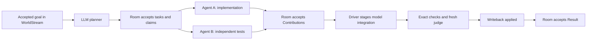

# Live Swarm coding demonstration — 22 September 2026

Follow-up: the [autonomous delivery demonstration](../agent-swarm-autonomous-delivery/README.md) subsequently passed with no evaluation-driver delivery plans or post-setup Actions. This page retains the earlier supervised run's boundaries and results.

**Attempt 16 passed all four goals in one live WorldStream Room: model-chosen decomposition, useful parallel execution, independent judging and successful file delivery.** It used subscription-backed `gpt-5.6-sol` at `medium` effort. The delivered artifact is [csv_tool.py](csv_tool.py).

WorldStream was the authoritative kernel throughout. The production adaptive planner selected ordinary work and its execution. A visible evaluation driver continued from Contributions through integration, review and delivery. This is a successful supervised demonstration; the production planner does not yet own the complete delivery loop.

## What happened

| Requirement | Observed evidence |
| --- | --- |
| Real decomposition | The LLM proposed **Implement strict CSV library and CLI** and **Design independent CSV behavioral test suite**, with no dependency between them. |
| Useful parallelism | Agent A authored implementation while Agent B authored tests. Their native turns overlapped for **96.426 seconds**; both Contributions were accepted. |
| Integration | A model-authored integration Candidate referenced both accepted Contributions. It retained the implementation behavior and changed a comment. |
| Fixed checks | Candidate version 1 passed **26/26** predeclared behavioral checks in the guarded read-only, network-disabled checker. |
| Independent judging | The reserved judge, which authored no Contribution, reviewed the exact Candidate in a separate fresh session and returned `passed`, with no findings. It used the same model family; it was not JEV. |
| Delivery | The code-change service accepted the checked/reviewed revision, applied `csv_tool.py`, and reconciled writeback as `applied`. The Room then accepted one Result and reached `completed` at sequence **16**. |
| Recovery | One planning response omitted the required schema envelope. It was rejected before dispatch; the next reasoning response restored the envelope and the intended claim succeeded without operator intervention. |
| Cleanup | Managed processes stopped, the disposable provider profile was removed, and measured executable/harness identities stayed unchanged. |

The live trial took **583.318 seconds**; the full wrapper including managed setup and cleanup took **637.920 seconds** (10m 38s). It used **13 adaptive Invocations and 4 driver-staged delivery Invocations**. One of the adaptive Invocations was rejected. These counts exclude the native admission probes.

After Room completion, the evaluator separately executed Agent B's **26 authored tests** against the exact delivered source. All passed without changing either source or tests. This supplemental run was **not part of the live acceptance gate** and is not 26 additional distinct coverage requirements.

## Why event sourcing permits parallel work

An ordered event stream does not require serial computation. The Room establishes ownership and dependencies; workers can then compute independently against those accepted facts. Their proposed outcomes enter the stream in commit order and are validated against current authority and revisions.

In this run, both claims existed before the two WorkAttempts started. Agent B finished first, and its Contribution was accepted at Room sequence **7**. Agent A's Contribution followed at sequence **8**. Integration depended on both. The native work overlapped even though their accepted events have a definite order.

The kernel holds accepted history, ownership and versioned evidence. Swarm supplies reasoning and process execution. LLMs choose strategy; deterministic rules protect authority, artifact identity, dependency consistency and completion. Replaying accepted history reconstructs state; it is not permission to repeat external effects or rerun model calls.

## What a task means here

| Concept | Meaning in this run |
| --- | --- |
| Work Item | A durable, bounded deliverable with dependencies: implementation, independent tests or integration. |
| WorkAttempt | One owned attempt to perform a Work Item. Separate independent attempts can execute concurrently. |
| Invocation | One supervised model turn, including planning, metadata actions, authoring or judging. A task can need several Invocations. |
| Contribution | Attributed intermediate evidence/artifact. Both source and tests were Contributions. |
| Result | The integrated Candidate accepted against exact checks and review; neither a worker finishing nor a passing test alone is a Result. |

Coding is parallelizable when the responsibilities are independent or the dependency order is explicit. Here, code and tests were authored separately. Integration followed both. This does not demonstrate safe concurrent edits to a shared checkout: workers had no tools and returned complete artifacts through `inline_text` for immutable publication.

## What remains unproven

This small CSV task is a capability demonstration, not a reliability or speed benchmark. Fifteen earlier development attempts failed or were stopped; they involved changing implementations and evaluation conditions and are retained in [attempts.json](attempts.json). They are not an identical-trial success-rate sample.

The run does not establish general autonomous repository work, model-weight training, cross-run self-improvement, portable release qualification or a benefit from JEV. Within-run recovery was observed, but the rejected response received only a generic invalid-output status; precise schema feedback still needs improvement. Implementation fixes between attempts were made by the development agent.

The next priority is to let the production LLM planner continue from Contributions through integration, checks, independent review, revisions and authorized delivery. The authority boundaries should remain. Also bring agent-authored tests into the live gate and reduce proposal/claim overhead. See [the next steps](NEXT-STEPS.md) and [learnings](LEARNINGS.md).

## Evidence

- [Test design and boundaries](TEST-DESIGN.md), [implementation validation](VALIDATION.md)
- [Metrics and native intervals](metrics.json), [complete successful-run report](results.json)
- [Adaptive decisions and responses](attempt-16-adaptive.json), [delivery decisions and responses](attempt-16-delivery.json)
- [Fixed check evidence](checks/candidate-1.json), [fixed check output](checks/candidate-1.stdout), [independent authored-test replay](supplemental-authored-tests.json)
- [Final Room projection](final-observation.json), [writeback receipt](writeback-receipt.json)
- [Evidence integrity verification](evidence-verification.json), [executable and harness identities](executable-and-harness-identities.json)
- [Delivered source](csv_tool.py), [original implementation Contribution](contributions/contrib-a-csv-tool-v1.py), [test Contribution](contributions/csv-tool-independent-tests-v1.py)

The exported source matches the Candidate and writeback content digest `blake3:caa0fbf53cd2e3ea93b8718c23971ba9ed20a98fe9ebf0e6e99edf0cdb5e6d61` and SHA-256 `4cc5420708c7287b23b98de117815e0d20dbcb2435ccdb626588d2b59aa82fc4`. Native turn objects, check outputs, Contributions and admission receipts were verified against their retained digests. Credentials and the disposable provider profile were not exported.
