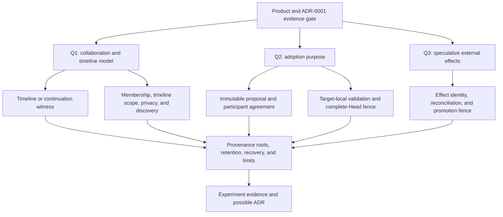

# Multiverse design interview

**Status:** non-normative draft decision log. This records an active design
interview; it creates no canonical term, protocol, API, implementation
commitment, or ADR amendment. Unresolved terms are not added to `CONTEXT.md`.
Once the interview resolves a term, update it inline; the architecture remains
proposed until shared understanding and any required ADR process are complete.

## Established user intent

The intended experience is autonomous Participants choosing independent
continuations of a shared problem. Alternatives may remain separate, or a
Participant may propose adopting useful work from one into another. Domain
legality and participant agreement are separate: the Activity Pack enforces
the former, while agreement expresses what its Participants choose to pursue
or adopt. There is no centrally scripted voting process, and agreement is not
a claim that an adopted result is task-solution truth.

This records interview input, not an existing WorldStream decision. It does
not alter the current meanings of Activity Pack, Outcome, Membership, or Room.

## Verified repository baseline

- A Room is one independent authoritative situation governed by exactly one
  Activity Pack, and a Room's immutable Pack Revision is pinned for its whole
  lineage. Canonical History is that Room's immutable Genesis and ordered
  Transitions; Authoritative Room State is only Core Room State plus Activity
  State. [`CONTEXT.md` lines 3, 7–8, 15–16, 39–56](../CONTEXT.md)
- ADR 0001 is accepted. It permits a server to host many independent Rooms,
  but freezes out cross-Room exchange, timeline forks, and branch promotion.
  Returning that scope requires both reference releases to pass, corroboration
  from two outside developers, a small ADR demonstrating that an adapter is
  insufficient, and protection against scope drift.
  [`ADR 0001` lines 5, 30–40, 55–65, 75–84](adr/0001-product-boundary.md)
- An accepted Transition has exactly one predecessor lineage hash, and each
  accepted Transition installs one complete Head. Repair may rebuild caches or
  restore verified bytes, but may not edit, skip, reorder, synthesize, or
  replace Genesis or a Transition. Thus a multi-parent canonical Transition or
  silently repointing an existing Room's Head conflicts with the accepted
  lineage contract.
  [`ADR 0005` lines 38–64, 66–70, 84](adr/0005-canonical-core-state-integrity-and-hash-lineage.md)
- The accepted commit contract is one Room-scoped all-or-none operation.
  Existing writes fence one Complete Head and atomically advance the Room's
  history, state, timers, membership materialization, Frames, Activation
  consequences, and receipt; durable database `COMMIT` is the sole
  linearization point.
  [`ADR 0006` lines 7, 11–19, 23–26](adr/0006-backend-neutral-atomic-room-commit.md)
- A Room retains the exact executor and codecs for its pinned Pack Revision;
  it neither changes Pack digest nor rewrites Activity State in place. The
  Pack seam remains five operations, has no storage/network/filesystem
  capability, and Packs cannot mutate another Room in the first public
  release.
  [`ADR 0010` lines 19–25](adr/0010-activity-pack-v1-and-executable-replay-retention.md)
  [`Activity Pack contract` lines 13–25, 159](activity-packs.md)
- Checkpoints are recovery acceleration, never a fork mechanism or an
  authority to publish/mutate. Accepted ADR 0031 verifies an exact checkpoint
  and operational witness before replaying at most a 250-Transition tail;
  invalid or ineligible checkpoints fall back to full Genesis replay.
  [`ADR 0031` lines 9–14, 17–59, 61–75](adr/0031-verified-checkpoint-recovery.md)
  ADR 0036 bounds accelerated-checkpoint eligibility and retains the full
  history/native operational records for forensic replay; ADR 0037 adds MMR
  receipts/proofs for bounded operational reads.
  [`ADR 0036` lines 24–42, 64–71, 75–110](adr/0036-bounded-operational-checkpoint-eligibility.md)
  [`ADR 0037` lines 24–30, 54–82](adr/0037-successor-anchored-operational-receipts.md)
- An external effect derives from a committed Room Transition, carries a
  separate stable effect operation/revision identity, is at-least-once with
  target idempotency, and remains `unknown` after an ambiguous delivery until
  a fenced probe resolves it. Replay does not cause effects.
  [`ADR 0035` lines 8–33, 35–41](adr/0035-durable-external-effect-reconciliation.md)
- Existing observation/activation retention is scoped operational retention:
  pruned Frames force Projection Reset and never alter Canonical History; an
  exact Invocation Context eventually becomes a hash-preserving tombstone.
  These rules do not define a retention policy for prospective fork bases,
  cross-Room provenance, or adoption evidence.
  [`Observation and Activation` lines 30–40, 149–150](observation-and-activation.md)

## Current branching material is research, not implementation

The branching-futures note labels itself non-normative, with no production
implementation or accepted-ADR change. It says the current kernel provides no
native continuation forks, cross-Room result adoption, or universal merge
validator; multiple Observation Streams are authorized views of one Room, not
different futures. Its suggested records are illustrative, rather than
canonical terms, schemas, or APIs.

[`Branching futures research` lines 1–11, 98–110, 124–136](worldstream-branching-futures-research.md)

That research offers a useful separation which matches the established intent:
the Pack answers whether an action is a legal continuation; Participants,
evaluators, or application policy decide whether an alternative merits more
resources; and a destination requires its own authority and validation before
being affected. It also warns that popularity is not a correctness proof.

[`Branching futures research` lines 19–29, 68–83](worldstream-branching-futures-research.md)

One research sentence says that the Pack owns “domain goals” and “voting
rules.” That is not accepted architecture and is narrower under this interview:
the Pack must not be assigned task-solution truth or centrally scripted voting
by implication. Any future agreement record must preserve the user intent
above and must be separately designed.

[`Branching futures research` line 132](worldstream-branching-futures-research.md)

Older Git-branching research describes ADR 0031 as having checkpoint-witness
limitations. That characterization predates the accepted ADR 0036 and ADR
0037 amendments above and is not evidence that bounded checkpoint recovery is
unimplemented. It may still inform future continuation-witness requirements,
but the current checkpoint facts are governed by the accepted ADRs.

[`Git branching research` lines 71–73](git-branching-lessons-research.md)

## Working hypothesis to examine — undecided

Room-per-timeline is not required. The unsettled comparison is between a Room
as the collaboration boundary and the boundary of mutable timeline state. One
candidate uses related Rooms and cross-Room provenance; another keeps one Room
and introduces independently fenced timelines inside it. Neither is settled,
and neither can bypass ADR 0001's revisit gates or the accepted
Room/lineage/atomicity contracts.

The current Runtime manages Rooms, while an Activity Pack Revision is a shared
rule definition. `ActivityPackV1` has no create-, list-, or join-Room
operation. This proposal therefore must not make a Pack the manager of Room
creation, discovery, or admission.

[`Activity Pack contract` lines 13–25, 159](activity-packs.md)

Multiple candidate timeline states can already be represented as Pack data in
one linear Room. They still share its one Room Head and admission fence, so
their Actions conflict through the global order. A hypothetical native timeline
inside one Room would instead require a revised Action basis — at least a
timeline Head plus the relevant Room Membership and policy fence — along with
new commit, Replay, and delivery-routing contracts. It need not imply a
multi-parent outer Room history.

Separate Rooms also do not imply an operating-system process or a resident
model per alternative. They do add Room-scoped Membership, state, timer,
observation, Activation, and recovery metadata. There is currently no
branch-cost benchmark or structural shared-prefix storage design; those costs
remain unmeasured.

## Design tree

The three questions below form the independent first-round frontier. Q2 and Q3
remain unanswered. Their answers, and Q1's clarification, determine the
vocabulary and contracts needed for the later branches.

### Round-1 clarification for Q1

❓ **Q1** - **Collaboration and timeline model**: Should independently
advancing alternatives be distinct Rooms with explicit cross-Room provenance,
or native timelines within one collaboration Room? A Pack may already model
several candidate states as Activity State, but those candidates share the
Room's global Head and conflict behavior; that is not independently fenced
timeline advancement.

➡️ Conditional recommendation: preserve both models for the comparison.
Room-per-timeline can reuse existing Room admission, commit, authority, and
recovery boundaries. Native independently fenced timelines inside one Room can
reuse its outer Membership boundary, but require explicit timeline admission
and scope plus amendments to the Action basis, commit, Replay, and routing
contracts.

❓ **Q1a** - **Admission scope within the chosen model**: Should a Participant
join the collaboration once and receive authority across permitted timelines,
with explicit per-timeline access/participation scope, or should every
alternative require separate admission and Membership?

➡️ Conditional recommendation: join the collaboration once, then represent
timeline access and participation separately. This is a proposed user model —
“join one Room, then choose, fork, or follow permitted timelines” — not a new
canonical term or an accepted authority rule.

❓ **Q2** - **What adoption means**: Do Participants need (a) a local UI
selection of a preferred continuation, which remains non-authoritative, (b) a
binding communal selection, recorded as an authorized durable domain record —
possibly in a coordination Room rather than solely in a non-authoritative
index — (c) to import a bounded contribution into an existing authoritative
Room, or (d) both as separate operations? Binding selection and target-local
import must not be conflated: import needs current target authority, legality,
and a Complete-Head fence.

➡️ Conditional recommendation while unanswered: keep local UI selection,
binding communal selection, and target-local import as three separate concepts.
Start the experiment with one binding selection and one bounded target-local
import. Do not promise generic state merge.

❓ **Q3** - **Speculative external effects**: While an alternative is
speculative, should it be effect-free/simulated, allowed only to prepare a
reviewable effect proposal, or allowed to dispatch real effects under a
separate per-alternative authority and budget?

➡️ Conditional recommendation while unanswered: effect-free or simulated by
default. A real effect should originate only from explicit committed
authorization under a cross-branch idempotency and reconciliation policy;
whether it reuses or creates an effect identity remains unresolved. No branch,
replay, reset, or restore may imply undoing or repeating it.

### Later questions, intentionally unresolved

After Q1, specify the continuation witness: source Room and complete Head,
exact Pack Revision, state/seed/clock/timer policy, authorized source evidence,
failure/recovery behavior, private-state boundary, and resource allocation.

After Q1, if alternatives are separate Rooms, specify new Memberships and
visibility rather than copying source credentials, observation streams, Cursors,
leases, or queued effects. If timelines are nested, specify each existing
Membership's timeline access/participation scope without duplicating the
Membership. In either model, establish how durable identity maps across
alternatives without turning one Room's Membership into authority in another.

After Q2, specify the immutable proposal identity, what evidence it fixes,
which Participants may agree, the scope of their agreement, and how the record
remains participant-chosen rather than centrally scripted. Agreement must not
be inherited by later source changes or treated as proof of task-solution
truth.

After Q2, specify target-local application: permitted contribution kinds,
deterministic Pack-legality validation, an optional independent task-result
validator, exact target Complete-Head fencing, changed-target conflict, and
the all-or-none receipt/Transition consequences.

After Q3, specify effect promotion, ownership, idempotency/reconciliation,
spending/resource budgets, and the rule for effects already dispatched by a
source alternative.

Budget, compute, and spending ownership are unresolved prospective policy.
They are not currently part of Core Room State, which contains only Room Status
and the semantic Membership map. Any per-timeline budget therefore needs a
separate explicit ownership and fencing design rather than an inferred Core
field. [`CONTEXT.md` lines 39–41](../CONTEXT.md)

For every path, specify a bounded discovery index, provenance/retention roots,
export and authorization rules, checkpoint/full-replay recovery, pruning,
active-alternative/fork-rate/compute/subscription limits, and experiment
measures. Before a kernel ADR, meet ADR 0001's product-evidence gates and show
why an adapter cannot meet the selected guarantees.
