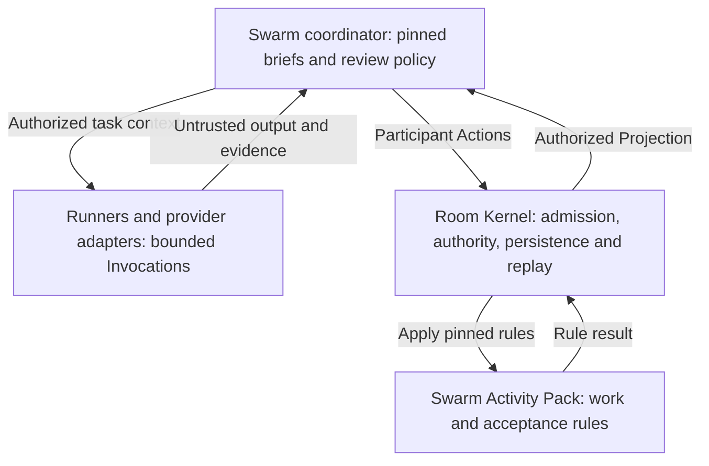

# Superpowers lessons for Agent Swarm

Research checked **2026-09-23** against primary source code, workflow documents,
and first-party evaluation reports. Superpowers was inspected at **v6.4.1**, commit
[`5bf4e78011075bcfc0dc295f0724994cd123ee71`](https://github.com/obra/superpowers/commit/5bf4e78011075bcfc0dc295f0724994cd123ee71)
(2026-09-18). Its separately maintained evaluation lab was inspected at
[`e64684cd1fa270c464ac797747e45bbe8d127e8b`](https://github.com/prime-radiant-inc/superpowers-evals/commit/e64684cd1fa270c464ac797747e45bbe8d127e8b)
(2026-09-11). Local comparison uses HEAD
`af4febb024a7e8475dbd707040b35c4deca648b3` **plus the current working tree**;
several inspected Swarm implementation files are uncommitted. Local links refer
to that inspected working tree, not an assertion that HEAD contains them.
This is a non-normative research note. No upstream scripts or live model
evaluations were executed, no plugin was installed, and runtime behavior was
not changed.

## Recommendation

**Adapt Superpowers' execution discipline in Agent Swarm's application policy
and evaluation tooling. Keep the Room Kernel unchanged.** Jesse Vincent and
Prime Radiant have built a portable coding methodology: teach the coordinating
agent when to load a skill, give workers precise bounded tasks, inspect their
outputs with deliberately different review questions, retain progress outside
conversation memory, and test whether these instructions change real behavior.
It is not a replacement for WorldStream's authoritative Rooms or deterministic
acceptance rules ([upstream overview][sp-readme], [SDD workflow][sp-sdd],
[WorldStream boundary](adr/0001-product-boundary.md)).

Our strongest opportunity is **better decisions and less coordination per
accepted Result**, not additional agents. In the retained September 22 delivery
run, 12 of 22 Invocations planned and six more only proposed or claimed work;
the first Candidate passed, so that run demonstrated neither live repair nor a
general reliability rate. The 84.202 seconds of overlapping authoring establishes
concurrency, not overall speedup
([run evidence](evidence/agent-swarm-autonomous-delivery/README.md),
[learnings](evidence/agent-swarm-autonomous-delivery/LEARNINGS.md)).

The proposed additions start in the first layer. A genuinely new shared
acceptance requirement would need a new immutable Activity Pack Revision;
prompt text cannot quietly change the meaning of existing review evidence.

## What Superpowers actually implements

| Area | Current source behavior | Strength of the mechanism |
| --- | --- | --- |
| Activation | A bootstrap tells the coordinator to consult relevant skills before acting. Claude's hook injects it at startup, clear and compact; Pi reinjects after compaction; OpenCode registers skills and skips bootstrap for detected child sessions. | Hook code loads context; compliance with most workflow rules is still model behavior. Codex's manifest has `skills` and empty `hooks`, so do not assume identical bootstrap behavior across harnesses. [Bootstrap][sp-bootstrap], [hooks][sp-hooks], [Pi][sp-pi], [OpenCode][sp-opencode], [Codex manifest][sp-codex]. |
| Planning | Classify work as spike, bounded or architectural; write the appropriate design. Plans carry a spec reference, global constraints, exact files, test commands and expected results, task interfaces, and review focus. | Primarily prompt instructions and Markdown artifacts, including explicit human approval stages. [Brainstorming][sp-brainstorm], [planning][sp-plans]. |
| Delegation | A controller gives a fresh implementer the task brief, relevant interfaces, report path and output contract. Worker/reviewer templates prohibit nested subagents. Small repeated mechanical edits may be batched. | The harness owns actual spawning. The policy constrains how the controller uses it; it does not provide a general scheduler. [Implementer contract][sp-implementer], [SDD workflow][sp-sdd]. |
| Review | One task reviewer reads the brief, report and diff and returns separate spec-compliance and quality verdicts. A final reviewer assesses the whole branch. Re-reviews examine named findings and the fix diff. | The reviewer has independent context; judgments remain fallible. The current template implements both questions in one task reviewer, so two review dimensions do not require two reviewer agents. [Task reviewer][sp-reviewer], [re-review][sp-rereview], [final reviewer][sp-final-reviewer]. |
| Execution helpers | Scripts extract task briefs, identify plan workspaces, build full commit-range review packages, and append inline task completion only after the supplied command exits successfully. | Real mechanical checks, with a narrower scope than authoritative workflow state. [Brief helper][sp-brief], [workspace helper][sp-workspace], [review package][sp-package], [task completion][sp-task-done]. |
| Behavioral evaluation | Test the agent under a tempting failure scenario without the instruction, add the instruction, repeat with fresh contexts, and inspect evidence. The separate Quorum lab drives real CLIs, uses private criteria and fresh assessors, and runs deterministic post-checks. | Measures behavior rather than merely whether the agent can repeat the policy. Outcomes still depend on fixture and grader quality. [Skill testing][sp-writing-skills], [eval lab][eval-readme]. |

### The details worth borrowing

**Make delegation a precise information contract.** The brief extractor keeps
one task's text together; the review-package helper captures the entire recorded
`BASE..HEAD` range and rejects an empty range or a head not descended from base.
This avoids accidentally reviewing only the last commit of a multi-commit task.
The implementer reports `DONE`, `DONE_WITH_CONCERNS`, `NEEDS_CONTEXT`, or
`BLOCKED`, with actual tests and concerns. These are more useful to a controller
than a generic success paragraph
([brief helper][sp-brief], [review package][sp-package],
[implementer template][sp-implementer]).

**Separate two review questions while reusing one reading of the evidence.**
The task reviewer asks whether anything required is missing, anything unwanted
was added, or the task was misunderstood, then asks about quality and edge cases.
It reports requirements it cannot verify from the diff. It may inspect outside
the diff for a named concrete risk. This can improve our current generic judge
instruction without doubling the number of reviewing Invocations. Its test rule
also avoids rerunning an unchanged suite merely to recreate already supplied
evidence; our adaptation must retain independently captured check receipts
([task reviewer][sp-reviewer],
[current judge instruction](../crates/worldstream-agent-swarm/src/coordinator_service/autonomy/delivery.rs#L411)).

**Design recovery around named, external artifacts.** Superpowers stores briefs,
reports, review packages and a ledger per plan, with a plan-path ownership marker
that disambiguates identical filenames. Both inline execution and SDD share
this format. Its policy tells the next context to read the ledger and Git rather
than repeat completed tasks. This is useful recovery discipline, but the scratch
directory is Git-ignored, can be deleted by cleanup, and is not a transactional
history. Our equivalent must be a bounded reconstruction from Room facts plus
operational records, never a competing Markdown authority
([workspace helper][sp-workspace], [inline execution][sp-inline],
[activation continuity](adr/0009-activation-intents-context-and-lease-fencing.md)).

**Bound the repair loop and change something when it stalls.** Current SDD
resumes the implementer for rounds 1–3, then uses a fresh, more capable implementer
for rounds 4–5. Re-review judges each old finding and new breakage in the fix,
instead of endlessly reopening the entire change. The useful principle is
diagnosing missing context, insufficient capability, oversized work or a bad
plan before retrying. The specific five-round threshold is a policy choice,
not a result demonstrated for our workload ([SDD workflow][sp-sdd],
[re-review template][sp-rereview]).

**Turn important completion claims into checkable evidence.** The verification
skill makes the agent identify and inspect a check before claiming success;
`task-done` adds a concrete exit-status gate to the inline ledger. Our existing
Candidate-bound check receipts already enforce a stronger version of this
principle. Reuse valid evidence for unchanged inputs; rerun affected checks
when the Candidate, criteria or input basis changes
([verification skill][sp-verification], [task completion][sp-task-done],
[local check binding](../packs/agent-swarm/src/workflow.ts#L695)).

**Match an instruction's shape to its failure.** The writing-skills guidance
distinguishes skipping a known rule from producing the wrong output shape,
omitting a field, and mishandling a condition. It recommends a positive recipe
for shape, a required field for omissions, and an observable predicate for
conditional behavior. It asks for a no-guidance control, at least five fresh
samples per wording variant, and manual inspection of apparent matches. This
fits our strict typed action envelopes particularly well: schema rejection can
be solved by an exact example or field-level feedback rather than a larger
collection of prohibitions ([writing-skills][sp-writing-skills],
[current response contracts](../crates/worldstream-agent-swarm/src/coordinator.rs#L3314)).

## Fit with what Agent Swarm already has

| Capability | Present local mechanism | Increment to test |
| --- | --- | --- |
| Authoritative acceptance | The Pack binds checks and review to Candidate, criteria and input versions, and preserves unresolved blocking findings. The delivery coordinator also excludes the Candidate and Contribution authors from judging. | Preserve this stronger boundary. Improve evidence gathering and rubric quality; do not replace gates with a controller's completion claim. [Pack](../packs/agent-swarm/src/workflow.ts#L695), [delivery readiness](../crates/worldstream-agent-swarm/src/coordinator_service/autonomy/delivery.rs#L627). |
| Independent review context | Candidate review and finding resolution already force a fresh provider conversation. | Add explicit completeness and quality prompts, including an evidence-gap category. Fresh context alone is not judgment diversity. [Session selection](../crates/worldstream-agent-swarm/src/coordinator_service/autonomy.rs#L553). |
| Typed delegation | The planner selects retained authorized targets and writes bounded worker instructions; workers receive exact Room basis and action contracts. | Render a standard brief with intended outcome, prerequisites, exact input references, constraints, expected output and verification expectations. Keep Room references authoritative. [Planner](../crates/worldstream-agent-swarm/src/coordinator_service/autonomy.rs#L250), [worker envelope](../crates/worldstream-agent-swarm/src/coordinator.rs#L3350). |
| Parallel work | The planner can dispatch distinct owned WorkAttempts on distinct members; metadata steps serialize, and planning waits for the whole selected batch. | Measure the cost of decomposition and scheduling. Prefer useful independent work and batch compatible bookkeeping only through validated semantics. Superpowers itself forbids parallel SDD implementers in a shared worktree. [Planner](../crates/worldstream-agent-swarm/src/coordinator_service/autonomy.rs#L250), [parallel skill][sp-parallel]. |
| Recovery and evidence | Current Invocations, rejected decisions, worker feedback, canonical references and delivery evidence survive operational reopen. | Generate compact role-specific recovery briefs from those records; record the prompt-policy revision operationally so behavior regressions can be attributed. [Adaptive planning](agent-swarm-adaptive-planning.md), [execution continuity ADR](adr/0038-local-subscription-cli-execution-for-agent-swarm.md). |
| Provider control | The human configures each roster member's provider, model and effort. Claude explicitly disables slash commands and `Agent,Task`, and restricts settings/MCP sources. | Adapt selected policy text through the existing provider envelope. Installing the upstream plugin is not integration with this execution path. [Claude adapter](../crates/worldstream-agent-swarm/src/execution/provider/claude.rs#L49), [ADR 0038](adr/0038-local-subscription-cli-execution-for-agent-swarm.md). |

Current autonomous delivery is deliberately one complete artifact to one
existing target file, at most eight Candidate versions, with supplied checker
commands. Separate contribution paths are instructions, not OS-enforced
isolation. Superpowers' Git worktree discipline does not by itself solve our
future multi-file integration, resource conflicts or provider confinement
([current limits](agent-swarm-adaptive-planning.md#current-limits),
[worktree skill][sp-worktrees],
[contribution/result boundary](adr/0040-separate-swarm-contributions-from-accepted-results.md)).

## Prioritized changes

1. **Add behavior regressions for our policy, alongside protocol tests.** Cover
   missing-context guesses, false completion claims, premature dependent work,
   extra scope, stale evidence, persistent findings, and repeated completed work
   after restart. Preserve private outcome checks and manually audit semantic
   grades. This is the largest transferable engineering practice, and it gives
   the following prompt changes an accountable adoption gate.
2. **Introduce versioned role instructions and generated briefs.** Begin at
   `provider_prompt` and the planner/integrator/judge instructions. Record exact
   prompt revision/digest in operational provenance; use the current authorized
   projection and artifact identities. Distinguish missing context from execution
   failure in operational feedback and map it to an existing proposal, blocker
   or handoff response. Preserve member-private conversation reuse and refreshed
   Room context. A fresh implementer after failure needs a recorded session or
   handoff policy with the same human-selected settings; fresh reviewer context
   is already enforced.
   Any extra output fields need an explicit versioned contract; do not ask a
   worker to emit prose that the current strict JSON parser cannot accept.
3. **Give the existing independent judge two explicit rubrics.** Require evidence
   for requirements, then quality/risk, before its existing final verdict. Keep
   one reviewing Invocation initially. Unverifiable material requirements should
   cause targeted evidence gathering or a finding, not automatic approval. Start
   with a validated application report; making both dimensions mandatory shared
   acceptance facts would require a new Activity Pack Revision.
4. **Make correction attempts diagnostic and scoped.** Carry the exact finding,
   Candidate version, prior attempt and covering evidence into a correction;
   recheck the changed material and preserve all blocking findings. At the
   configured limit, halt dependent work or request an authorized handoff. Reuse
   existing limits before inventing a second retry budget.
5. **Optimize coordination only after measuring it.** Track planning, ownership
   Actions, provider startup, checks, waiting and review separately. Trial fewer
   needless task boundaries and compact artifact references. Route to an eligible
   already configured roster member when appropriate; never silently change a
   member's model or effort. Treat executor changes for authored tests and
   multi-file isolation as separate implementation work.

These are research recommendations, not implementation commitments. They fit
Agent Swarm application policy and its Runner/provider adapters. Optional
Pack-level additions are warranted only if a new shared review fact needs
authoritative semantics. No reviewed lesson requires a new Room Kernel concept
([ADR 0001](adr/0001-product-boundary.md),
[ADR 0003](adr/0003-separate-activation-and-action-authority.md)).

Keep these contracts useful for non-coding goals too: a research Contribution
needs source identities, citations and evidence gaps; a writing Contribution
needs audience, constraints and an editorial rubric. Do not make Git, executable
tests or a coding-specific skill a prerequisite for every Swarm
([ADR 0040](adr/0040-separate-swarm-contributions-from-accepted-results.md)).

## What not to copy unchanged

- **Prompt wording as authority.** Superpowers' strong language is behavioral
  guidance. Our typed proposals still require WorldStream acceptance; a skill
  must not grant tools, ownership, model changes or Result acceptance.
- **Nested coordinators or a mandatory agent per small edit.** Our application
  already coordinates the roster. Embedding SDD inside every worker would add a
  second scheduler and unaccounted execution. Upstream itself now forbids worker
  subagents and batches same-shape edits ([implementer][sp-implementer]).
- **Parking unresolved blockers to finish.** SDD permits controller rulings after
  its retry cap, including deferral of real findings. Our accepted-result rules
  require explicit resolution of blocking findings; a retry cap cannot waive
  them ([SDD][sp-sdd], [ADR 0040](adr/0040-separate-swarm-contributions-from-accepted-results.md)).
- **Unconditional ceremony.** Requiring fresh approval for every design stage,
  loading a skill on a 1% relevance guess, or making every change use literal
  TDD may add delay. Use the agreed goal, task risk and existing authorization
  to choose process; preserve the user's preferences ([bootstrap][sp-bootstrap],
  [brainstorming][sp-brainstorm], [TDD][sp-tdd]).
- **Unqualified model escalation.** Upstream recommends explicit cost/role-based
  model choices and stronger late-stage repair. Our human-selected roster is
  binding; permitted reassignment is different from silent reconfiguration
  ([SDD][sp-sdd], [ADR 0038](adr/0038-local-subscription-cli-execution-for-agent-swarm.md)).

## Evidence and limits

The main repository has infrastructure tests and skill behavior tests; its
documentation explicitly distinguishes description recall from actual behavior.
The separate Quorum lab now uses Bun/TypeScript, despite an older Python-harness
description remaining in the main testing page. It supports stock versus pinned
Superpowers comparisons while preserving harness/model/effort settings; this is
a useful experiment design, not evidence that every treatment wins
([testing guide][sp-testing], [eval package][eval-package],
[comparison suite][eval-suite]).

Two unusually useful examples show why evidence must remain qualified:

- The July plan-workspace study reports that its hypothesized stale-ledger
  failure **did not reproduce** in its baseline. The change was justified
  structurally, and the reported resume tool-call mean rose from 9.0 to 9.6;
  it explicitly does not claim a measured cost reduction. Its five-repetition
  cells and synthetic fixtures do not establish broad reliability
  ([published study][sp-workspace-eval]).
- A September Quorum campaign initially graded all 12 conversations as passes;
  a subsequent audit supported ten and identified two false passes. One reviewer
  asserted an exploit consequence unsupported by the supplied code; one design
  omitted a required choice. The report retains those negative results and
  separates harness execution success from grader reliability. It is evidence
  for auditing judges, not a universal defect rate ([experiment report][eval-experiment]).

Our own retained run similarly distinguishes the 26 fixed live acceptance
checks from 26 independently authored tests that passed only in a supplemental
post-run replay. Making authored tests part of live acceptance needs an
explicitly authorized isolated executor and version binding; an agent reporting
tests in a Contribution is not that execution
([local test-evidence distinction](evidence/agent-swarm-autonomous-delivery/LEARNINGS.md#3-test-contributions-should-participate-in-live-acceptance)).

## A bounded pilot

Keep the existing single-file CSV delivery goal, provider roster, models,
criteria and budgets. Keep the goal's requirements visible to the agents while
holding independent test implementations and grading rubrics outside their
editable working area. Compare the current policy with an adapted brief plus
one-reviewer/two-rubric policy. First use controlled provider fixtures to check
unchanged authority, versioning, cancellation and finding persistence. Then run
fresh repeated live cases with the same fixtures and alternate arm order:

| Case | Expected observable result |
| --- | --- |
| Ordinary CSV goal | Accepted correct artifact without adding redundant task/review cycles. |
| Seeded failing Candidate | Failed independent check, model-authored correction, new exact checks/review and accepted delivery; no evaluator repair. |
| Plausible missing requirement | Judge identifies a requirement gap despite passing partial checks; correction preserves the original criteria. |
| Missing prerequisite/context | Planner gathers the required evidence or records a blocker before dependent work. |
| Restart during correction | Resume the same outstanding work and finding without repeating completed work or accepting stale evidence. |

Use at least five fresh samples per wording variant for cheap micro-tests; use
repeated live trials with an explicit total Invocation and wall-time budget,
counting failed attempts. Measure independent criterion satisfaction, false
acceptance, reviewer false positives, unnecessary work, correction rounds,
planning/worker/review Invocations, startup/check/wait latency, and provider
usage where actually available. Human-audit semantic verdicts blind to the arm.
Adopt only if useful outcomes improve without authority regressions and the
coordination cost remains acceptable. This tests an adaptation, not the whole
Superpowers installation, and small samples remain exploratory.

## Adoption and source references

Superpowers is MIT licensed, with Jesse Vincent's copyright notice; copying
substantial text/code requires retaining the notice. Its installation and tool
mapping vary by coding harness. For our application, a small pinned selection
of adapted policy templates is easier to qualify than automatic plugin updates;
keep provenance and license alongside any copied material
([license][sp-license], [manifests][sp-codex], [installation overview][sp-readme]).

[sp-readme]: https://github.com/obra/superpowers/blob/5bf4e78011075bcfc0dc295f0724994cd123ee71/README.md
[sp-bootstrap]: https://github.com/obra/superpowers/blob/5bf4e78011075bcfc0dc295f0724994cd123ee71/skills/using-superpowers/SKILL.md
[sp-hooks]: https://github.com/obra/superpowers/blob/5bf4e78011075bcfc0dc295f0724994cd123ee71/hooks/hooks.json
[sp-pi]: https://github.com/obra/superpowers/blob/5bf4e78011075bcfc0dc295f0724994cd123ee71/.pi/extensions/superpowers.ts
[sp-opencode]: https://github.com/obra/superpowers/blob/5bf4e78011075bcfc0dc295f0724994cd123ee71/.opencode/plugins/superpowers.js
[sp-codex]: https://github.com/obra/superpowers/blob/5bf4e78011075bcfc0dc295f0724994cd123ee71/.codex-plugin/plugin.json
[sp-brainstorm]: https://github.com/obra/superpowers/blob/5bf4e78011075bcfc0dc295f0724994cd123ee71/skills/brainstorming/SKILL.md
[sp-plans]: https://github.com/obra/superpowers/blob/5bf4e78011075bcfc0dc295f0724994cd123ee71/skills/writing-plans/SKILL.md
[sp-sdd]: https://github.com/obra/superpowers/blob/5bf4e78011075bcfc0dc295f0724994cd123ee71/skills/subagent-driven-development/SKILL.md
[sp-implementer]: https://github.com/obra/superpowers/blob/5bf4e78011075bcfc0dc295f0724994cd123ee71/skills/subagent-driven-development/implementer-prompt.md
[sp-reviewer]: https://github.com/obra/superpowers/blob/5bf4e78011075bcfc0dc295f0724994cd123ee71/skills/subagent-driven-development/task-reviewer-prompt.md
[sp-rereview]: https://github.com/obra/superpowers/blob/5bf4e78011075bcfc0dc295f0724994cd123ee71/skills/subagent-driven-development/re-review-prompt.md
[sp-final-reviewer]: https://github.com/obra/superpowers/blob/5bf4e78011075bcfc0dc295f0724994cd123ee71/skills/requesting-code-review/code-reviewer.md
[sp-brief]: https://github.com/obra/superpowers/blob/5bf4e78011075bcfc0dc295f0724994cd123ee71/skills/subagent-driven-development/scripts/task-brief
[sp-workspace]: https://github.com/obra/superpowers/blob/5bf4e78011075bcfc0dc295f0724994cd123ee71/skills/subagent-driven-development/scripts/sdd-workspace
[sp-package]: https://github.com/obra/superpowers/blob/5bf4e78011075bcfc0dc295f0724994cd123ee71/skills/subagent-driven-development/scripts/review-package
[sp-task-done]: https://github.com/obra/superpowers/blob/5bf4e78011075bcfc0dc295f0724994cd123ee71/skills/executing-plans/scripts/task-done
[sp-inline]: https://github.com/obra/superpowers/blob/5bf4e78011075bcfc0dc295f0724994cd123ee71/skills/executing-plans/SKILL.md
[sp-parallel]: https://github.com/obra/superpowers/blob/5bf4e78011075bcfc0dc295f0724994cd123ee71/skills/dispatching-parallel-agents/SKILL.md
[sp-worktrees]: https://github.com/obra/superpowers/blob/5bf4e78011075bcfc0dc295f0724994cd123ee71/skills/using-git-worktrees/SKILL.md
[sp-tdd]: https://github.com/obra/superpowers/blob/5bf4e78011075bcfc0dc295f0724994cd123ee71/skills/test-driven-development/SKILL.md
[sp-verification]: https://github.com/obra/superpowers/blob/5bf4e78011075bcfc0dc295f0724994cd123ee71/skills/verification-before-completion/SKILL.md
[sp-writing-skills]: https://github.com/obra/superpowers/blob/5bf4e78011075bcfc0dc295f0724994cd123ee71/skills/writing-skills/SKILL.md
[sp-testing]: https://github.com/obra/superpowers/blob/5bf4e78011075bcfc0dc295f0724994cd123ee71/docs/testing.md
[sp-workspace-eval]: https://github.com/obra/superpowers/blob/5bf4e78011075bcfc0dc295f0724994cd123ee71/docs/superpowers/specs/2026-07-06-sdd-plan-scoped-workspace-eval-results.md
[sp-license]: https://github.com/obra/superpowers/blob/5bf4e78011075bcfc0dc295f0724994cd123ee71/LICENSE
[eval-readme]: https://github.com/prime-radiant-inc/superpowers-evals/blob/e64684cd1fa270c464ac797747e45bbe8d127e8b/README.md
[eval-package]: https://github.com/prime-radiant-inc/superpowers-evals/blob/e64684cd1fa270c464ac797747e45bbe8d127e8b/package.json
[eval-suite]: https://github.com/prime-radiant-inc/superpowers-evals/blob/e64684cd1fa270c464ac797747e45bbe8d127e8b/suites/conversation_routine_use.yaml
[eval-experiment]: https://github.com/prime-radiant-inc/superpowers-evals/blob/e64684cd1fa270c464ac797747e45bbe8d127e8b/docs/experiments/2026-09-07-conversation-broad-signal.md
