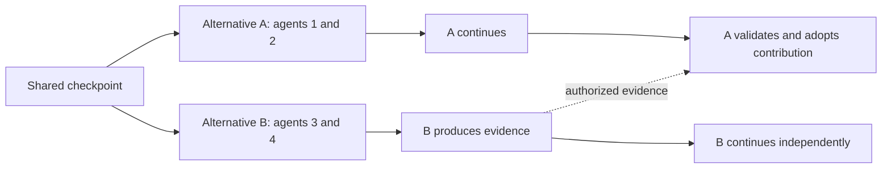

# WorldStream: research direction for independently progressing alternatives

Date: 2026-09-13. Status: non-normative research and proposed experiments. No production implementation or change to accepted ADRs.

## Recommendation

Pursue the hypothesis that independent participants benefit from **durable alternatives they can discover, join, continue, and selectively combine under explicit rules**. Branching alone is already implemented elsewhere. The potential product value is making collective work across alternatives reliable and understandable without requiring a single framework, continuously resident agent, or global agreement on every step.

The user's multiverse analogy captures an important distinction: several alternatives may remain useful and valid. They need not converge to one final stream. A participant can leave one approach, join another, or contribute evidence to several. Integration is optional; agreement is local to the decision it authorizes.

This extends the previously parked BranchLab idea. BranchLab described launching alternative coding strategies and selecting one. The current proposal also allows multiple independent agents to collaborate within each alternative, continued exploration after another branch succeeds, and selective reuse across alternatives. Neither native fork nor integration is implemented in the current protocol. [Earlier concept](ideas-and-research.md#2-branchlab--git-for-live-agent-futures), [current protocol](protocol.md), [kernel readiness audit](community-hanoi-kernel-readiness.md).

Supporting research notes:

- [Original Git and subsequent storage/merge lessons](git-branching-lessons-research.md)
- [Agent exploration papers and negative controls](agent-branching-evidence-research.md)
- [Current implementation landscape](branching-agent-product-landscape.md)

## First principles: what actually needs agreement?

There are three different questions:

1. **Is this a legal continuation within this Room?** Its pinned Activity Pack and guarded Room commit answer this.
2. **Is this continuation promising enough to receive more resources?** Participants, evaluators, or an application policy can decide. A minority approach may deserve a bounded experiment without winning a global vote.
3. **Can this result affect another Room or a shared external resource?** The destination needs explicit authority, applicable evidence, and validation of the proposed change.

Putting all three decisions behind one global vote forces unnecessary coordination. Giving each branch unlimited resources merely moves the bottleneck. The useful boundary is independent exploration inside a declared budget, with explicit coordination at shared constraints and integration points.

Branching reduces immediate interference but can increase duplicate work, incompatible assumptions, evaluation cost, and delayed conflicts. Whether that trade improves outcomes is an empirical question. One authoritative order **per Room** remains compatible with many independent alternatives. A large candidate tree stored inside one Room still shares that Room's ordering and admission bottlenecks.

## Evidence that informs the direction

The following separates source findings from WorldStream design inferences. These are published systems, proofs, or authors' reported experiments; none qualifies our proposed 100-agent, day-long deployment.

| Primary source | Evidence | Implication and limit |
| --- | --- | --- |
| [Semantics of Concurrent Revisions, ESOP 2011](https://www.microsoft.com/en-us/research/wp-content/uploads/2016/02/semantics-revisions-2010.pdf) | Forked tasks have isolated state; changes integrate at joins with deterministic conflict resolution. The paper proves determinacy for its revision calculus and visualizes nonlinear histories. | A close formal precedent for the multiverse model. Its guarantee depends on its program and merge semantics; it does not make arbitrary agent choices deterministic or preserve every domain invariant. |
| [Mergeable Replicated Data Types, OOPSLA 2019, author manuscript](https://www.cs.purdue.edu/homes/suresh/papers/oopsla19-mrdt.pdf) | Uses datatype-specific three-way merging with a common ancestor; Quark derives merge functions from relational specifications under stated conditions. | Merge semantics belong to declared data types. This is stronger grounding than asking an LLM to combine arbitrary JSON, but not a universal Room merger. |
| [Certified Mergeable Replicated Data Types, PLDI 2022](https://arxiv.org/abs/2203.14518) | Peepul verifies three-way merge implementations using F*, extracts OCaml, and uses them in Irmin. Its method can verify specifications beyond convergence. | There is implementation and verification precedent for a small library of typed merge policies. Correctness still means the specified properties, not unstated product intent. |
| [Coordination Avoidance in Database Systems, PVLDB 2014](https://www.vldb.org/pvldb/vol8/p185-bailis.pdf) | Invariant confluence characterizes when independently valid states can safely converge without coordination, for specified operations, invariants, and merge semantics. | Identify the actual invariants requiring coordination. Disjoint fields or deterministic output do not establish safe combination. Keeping speculative alternatives separate does not require them to converge. |
| [Go-Explore, Nature 2021](https://www.nature.com/articles/s41586-020-03157-9) | Preserves promising environment states, returns to them, and explores further. | Strong support for retaining stepping stones and returning to earlier choices in environments that permit it. No generic state merge or real-world rollback. |
| [Darwin Gödel Machine, 2025](https://arxiv.org/html/2505.22954v1) | Keeps an archive of agent implementations; the successful lineage includes temporary performance declines. Experiments used 80 iterations and two or four parallel iterations. | Supports preserving selected dissenting approaches instead of continuing only the current winner. It is not evidence for 100,000-turn shared-state operation. |
| [Graph of Thoughts, AAAI 2024](https://arxiv.org/html/2308.09687v4) | Generates new candidate information by aggregating earlier contributions and then evaluating it. | Importing and synthesizing evidence is useful even when two environment states cannot merge. Provenance does not make the new candidate correct. |

The formal literature addresses state composition; agent search literature addresses exploration policy. Combining those two is a plausible engineering direction, not an established theorem about agent collaboration. Replicated copies that are required to converge also differ from speculative alternatives that are intentionally allowed to disagree.

Current products narrow the novelty claim. LangGraph exposes checkpoint forks and independent thread copies; Dolt exposes database branches and merge conflicts; Claude Code exposes worktrees and peer messaging. A product case must show why developers need WorldStream's shared participation, visibility, validation, and continuity contracts together. This review cannot establish that the combination is unique in the market. [LangGraph time travel](https://docs.langchain.com/oss/python/langgraph/use-time-travel), [thread API](https://docs.langchain.com/langsmith/use-threads), [Dolt branches](https://www.dolthub.com/docs/sql-reference/version-control/branches/), [Claude Code messaging](https://code.claude.com/docs/en/cross-session-messaging).

There is also counterevidence to indiscriminate collaboration. A controlled agent-scaling study reports worse performance for all tested multi-agent architectures on its sequential-planning benchmark; its tested team sizes do not establish behavior at 100 participants. Use this as a reason for matched-budget controls, not a universal prohibition on teams. [Study, December 2025](https://arxiv.org/html/2512.08296v1).

A recent, direct challenge is **STORM**, a May 2026 preprint. It coordinates agents in a shared code workspace using checks on previously read files and reports better benchmark results than its Git-worktree baseline. Its experiments reach eight engineers, with benchmark and tool-boundary limitations detailed in the landscape note. This argues against isolating every contribution by default: related work can benefit from detecting interference early. Our hypothesis should therefore combine shared-state collaboration within each alternative with branching for materially different hypotheses or experiments. Include that coordinated shared-state baseline in evaluation. [Versioned paper](https://arxiv.org/html/2605.20563v1).

## What to borrow from Git

Git's original implementation already separates immutable content-addressed objects from mutable working state and records multiple parents. Later Git adds sophisticated merge algorithms and storage indexes. We should borrow these separations, not copy the 2005 byte format or put every kernel operation through the Git CLI. [Original README](https://github.com/git/git/blob/e83c5163316f89bfbde7d9ab23ca2e25604af290/README), [original commit constructor](https://github.com/git/git/blob/e83c5163316f89bfbde7d9ab23ca2e25604af290/commit-tree.c).

| Git lesson | WorldStream application |
| --- | --- |
| Immutable objects share unchanged ancestry | A future fork can reference retained verified source material; it should not duplicate the entire past. Actual continuation state must still be available. |
| Branch identity differs from a worktree | An alternative can outlive any Runner. Several agents can work in one alternative; a dormant alternative needs no running model. |
| Merge compares a base and both sides | Retain the exact basis, proposed contribution, dependencies, and destination revision. |
| Updating a ref can check its expected old value | Prepare an integration candidate, then fence and validate its destination at the actual commit. |
| Storage indexes and compression are replaceable | Optimize retention and queries without changing canonical identity. Logical ancestry and physical delta encoding are different graphs. |
| Reachability informs retention | Keep fork bases, accepted evidence, recovery dependencies, and in-flight operations protected from collection. Current retention guarantees remain authoritative. |

These applications are proposals. Git permits moving a ref backward; an existing WorldStream Room cannot silently rewind or replace its Canonical History. A content hash proves identity, not correctness, authority, or consensus. A small branch reference also does not make environment copies, model calls, or validation inexpensive. [Expected-value ref updates](https://git-scm.com/docs/git-update-ref), [merge bases](https://git-scm.com/docs/git-merge-base), [packfiles](https://git-scm.com/book/en/v2/Git-Internals-Packfiles), [commit-graph index](https://git-scm.com/docs/commit-graph), [GC caveats](https://git-scm.com/docs/git-gc#_notes).

## Four distinct ways work can meet

Use separate product operations rather than one ambiguous “merge” button:

- **Select a result:** designate a verified Outcome or continuation for a particular objective. This does not erase other alternatives or rewrite an existing Room's Head.
- **Import a contribution:** bring an authorized Artifact, experiment result, or proposed Action sequence into another context. Validate its present applicability; proposed Actions execute against current target state.
- **Combine contributions:** construct a new candidate using several results. The Activity Pack validates the complete result and its dependencies.
- **Continue separately:** preserve both approaches when integration is unnecessary or invalid.

An agent may propose a resolution. The runtime checks identity and authority; the Activity Pack checks its rules. If a goal cannot be fully verified mechanically, record the evaluator or human decision and the limits of that assurance. Do not present popularity as a correctness proof.

For Hanoi, from the same initial board, one branch moves the smallest disk A→B and another moves it A→C. Both moves are legal. Unioning the resulting boards places one disk twice. The sensible operation is path selection or reuse of a strategy under checked preconditions. Even matching board arrays do not establish interchangeable futures if timers, rules, available resources, or knowledge differ. Equivalent domain states may share stored content while retaining distinct provenance.

For a useful semantic-conflict test, use a small planning Pack. Branch A creates a plan reserving six units for task X; branch B reserves six for task Y; capacity is ten. The edits affect different tasks and each passes alone, but the combination fails. Resolution could change the schedule, reduce requirements, choose one plan, or remain separate. A failed invariant should produce an explicit conflict with the affected resources and allowed next Actions.

The provenance graph stays acyclic because records reference already established records. The domain state graph can revisit the same board or other equivalent state. Time travel creates another continuation; it does not change recorded history or undo an external effect. Simulation time policy must be explicit, and forking must not reset the community room's real one-day deadline or duplicate its spending allocation.

This conceptual product graph shows selective reuse while both alternatives remain alive; its edges are not a proposed replacement for the current Transition hash chain:

## Candidate contracts to investigate

These are illustrative records for a research prototype, **not new canonical terms, accepted schemas, or existing APIs**:

| Record | Minimum information to make the operation reviewable |
| --- | --- |
| Fork request | Stable operation identity; source Room and complete source Head; exact Pack Revision; authorized export/continuation witness; requested participation, clock, and effect policies |
| Alternative index entry | Referenced Room; parent provenance; current Head; bounded objective/progress evidence; availability; access and resource-policy references |
| Integration proposal | Immutable source evidence; target Room and expected Head; base if required; exact candidate and validator identities; dependencies; authority policy; intended domain change |
| Endorsement | Eligible identity; exact proposal digest; policy/electorate version; decision and validity scope |
| Conflict result | Proposal identity; failed invariant or changed dependency; relevant authorized evidence; admissible resolution Actions |

Endorse an immutable proposal, not a moving branch label. Otherwise later changes inherit votes for work the voters never inspected. An immutable source result need not become invalid just because its originating branch continues; the proposal must declare whether it adopts that fixed result or requires the source to remain at its latest Head. Destination applicability and authority must still hold at commit.

Forking must establish destination Memberships and visibility deliberately. Copying source access credentials, private observation streams, leases, or queued external effects is not a valid default. A storage snapshot alone is insufficient to establish these semantics.

A late participant's experience should be:

1. List a bounded page of authorized alternatives, with exact progress evidence and objectives.
2. Choose an alternative or request a budgeted fork.
3. Join its Room and receive a Projection Reset with current authorized facts and Action Offers.
4. Request only the referenced evidence relevant to its next decision.
5. Submit an Action and observe its accepted consequence or rejection.

The full graph belongs in durable storage and paginated inspection. It does not belong in every prompt. Summary scores and agent-authored explanations are non-authoritative views linked to their evidence; they cannot replace current legal Actions or canonical facts.

## Fit with the current kernel

The existing kernel supplies useful building blocks: immutable history, complete Heads, typed Actions, deterministic Pack execution, scoped Projections, Memberships, idempotent commit, and external Runners. It does **not** supply native continuation forks, cross-Room result adoption, or a universal merge validator. Multiple Observation Streams currently describe different authorized views of one Room, not different futures.

The smallest design worth evaluating keeps each Room's linear Canonical History and adds explicitly authorized relationships between Rooms. A fork could initialize a new Room through a versioned, validated continuation contract. An import could become an ordinary destination Transition with exact source evidence in its recorded input. This still requires new semantics; copying database rows is not an implementation of the contract.

Adding multi-parent Transitions is a separate, larger option. Do not make it a prerequisite for observing a graph of related Rooms. A product graph can refer to exact points on several linear lineages without changing the existing hash-chain definition.

The Pack owns domain goals, legal combinations, and voting rules. The kernel owns authority, identities, fences, bounded inputs, and durable consequences. External Runners choose strategies. We should not add a sixth Pack callback just because the UI says merge: first determine whether a typed integration Action with recorded bounded inputs expresses the domain operation. A reusable fork/transfer boundary still needs explicit review.

An Artifact digest alone does not give a Pack access to its bytes. The importer must supply authorized, bounded, replayable evidence in the recorded Stimulus, or a clearly attributed external validation result with an explicit trust policy. The exact retained Pack must be able to validate deterministically from its permitted inputs; integration must not introduce hidden network reads. [ADR 0010](adr/0010-activity-pack-v1-and-executable-replay-retention.md).

[ADR 0001](adr/0001-product-boundary.md) currently excludes this feature family and specifies revisit conditions. [ADR 0005](adr/0005-canonical-core-state-integrity-and-hash-lineage.md) fixes one prior lineage hash per Transition; [ADR 0006](adr/0006-backend-neutral-atomic-room-commit.md) commits one Room atomically. Research does not override those decisions. Any production proposal must identify the exact amendments needed and why an external adapter cannot meet the required guarantees.

Branching also does not resolve the previously found long-session gaps: bounded active-room recovery, large-history storage, real guest admission, and concurrent Actions still require qualification. Within one branch, the current exact-basis Action fence can still reject work after intervening votes. Smaller groups reduce contention; they do not change that contract. [Readiness audit](community-hanoi-kernel-readiness.md).

## Research next steps and decision criteria

We have enough evidence to define an experiment. More broad paper collection is unlikely to settle product value. The next research should answer specific uncertainties:

1. **Specify the fork boundary.** Write one worked example covering exact source state, timers, new Memberships, source privacy, external effects, resource allocation, failure, and recovery. Compare a graph inside a Pack, an external related-Room adapter, and native continuation creation.
2. **Exercise three integration cases.** Select a Hanoi path; combine complementary planning contributions; reject two individually valid contributions whose combination exceeds a shared constraint. Include target changes during evaluation and a source that progresses after an immutable result was endorsed.
3. **Compare equal-budget policies.** Run a sequential verifier baseline, immediate step voting, independent best-of-N attempts, branching with evidence import, and branching with typed combination. Use several task instances and seeds; give all policies equal model/tool budgets and the same validators. Include deceptive intermediate progress so preserving minority lineages has a chance to matter.
4. **Separate reasoning benefit from runtime capacity.** Scripted participants can test 100 total active agents, queued admission, 100,000+ accepted Transitions, late joins, crash recovery, and observer fanout. Live models test strategy quality and cost. Define Actions, rejected attempts, Transitions, and model turns separately in reports.
5. **Validate developer demand before a kernel ADR.** Preserve ADR 0001's existing roadmap gates: both reference releases pass acceptance; at least two outside developers identify the same missing capability; a small ADR explains why an external adapter cannot solve it; the addition does not turn WorldStream into a workflow engine, model host, or marketplace. Compare implementation effort against existing checkpoint/thread-copy primitives and record where an adapter fails an actual requirement. The experiments here add evidence to those gates rather than silently replacing them.

Measure verified success, time and spend per success, useful reused contributions, duplicate work, stale Actions, failed integration reasons, recovery/join latency, current-context bytes, retained bytes, and subscriber fanout. Credit branches that supply useful evidence even if their final candidate is not selected. Protect against evaluator overfitting with held-out instances and preserve failure traces.

Set separate limits on active agents, active branches, fork rate, computation, retained material, and subscriptions. The showcase's 100-agent cap is a total admission budget, not 100 agents multiplied by every branch. Dormant alternatives should cost storage rather than ongoing model execution. Retention policy must continue to preserve canonical and recovery evidence.

Proceed toward a kernel proposal only if collaborative alternatives outperform or materially simplify the equal-budget controls and require common guarantees that adapters cannot provide. If independent attempts perform equally well, simplify to durable alternatives plus result selection. If typed import provides the benefit, defer generic state merge. If a second domain needs a different integration algorithm, preserve domain-specific rules rather than forcing a universal merger.

The strongest product hypothesis is: **WorldStream lets independent agents work in different durable continuations of a shared problem, while making the reasons and authority for adopting each contribution observable.** The graph is how users inspect this behavior; explicit state, participation, and integration semantics are what make it dependable.
